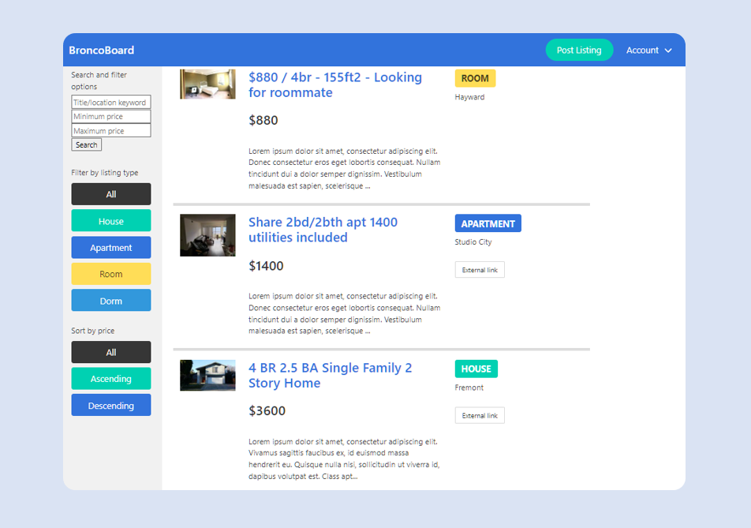

# Rental Listing

- Made using Ruby on Rails, EJS templating, and Bulma for formatting.
- Users can sign up, create new rental post, search and filter current listings, along with in app messaging for communicating with other users.
- Admin control panel to manually edit or delete listing information.
- Supports authorization using Devise for Rails, and user image uploading to AWS Simple Storage Service.

